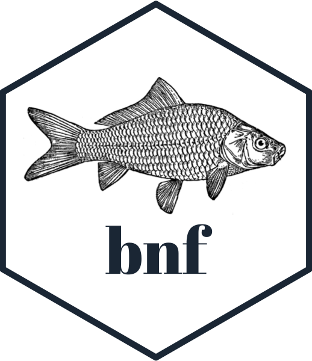

<!-- README.md is generated from README.Rmd. Please edit that file -->

```{r, include = FALSE}
knitr::opts_chunk$set(
  collapse = FALSE,
  comment = "#>",
  fig.path = "man/figures/README-",
  out.width = "100%"
)

library(ggplot2)
library(bnf)
```


```{r echo = FALSE, eval = FALSE}
# Quick logo generation. Borrowed heavily from Nick Tierney's Syn logo process
library(magick)
library(showtext)
font_add_google("Abril Fatface", "gf")


# pkgdown::build_site(override = list(destination = "../coolbutuseless.github.io/package/devout"))
```


```{r echo = FALSE, eval = FALSE}
img <- image_read("man/figures/fish.gif")


hexSticker::sticker(subplot  = img,
                    s_x      = 1,
                    s_y      = 1.2,
                    s_width  = 1.5,
                    s_height = 1.5,
                    package  = "bnf",
                    p_x      = 1,
                    p_y      = 0.6,
                    p_color  = "#223344",
                    p_family = "gf",
                    p_size   = 9,
                    h_size   = 1.2,
                    h_fill   = "#ffffff",
                    h_color  = "#223344",
                    filename = "man/figures/logo.png")

image_read("man/figures/logo.png")

# 
```


# bnf 

<!-- badges: start -->

<!-- badges: end -->

The goal of `bnf` is to parse grammar specifications in 
[Backus–Naur form (BNF)](https://en.wikipedia.org/wiki/Backus%E2%80%93Naur_form) 
and generate language from that grammar.

The focus for #OzUnconf19 was to generate valid R code from a very restricted
subset of the R grammar.

This generated code was then evaluated at multiple grid locations and plotted.


## Installation

And the development version from [GitHub](https://github.com/) with:

``` r
# install.packages("devtools")
devtools::install_github("coolbutuseless/minilexer")
devtools::install_github("ropenscilabs/bnf")
```
## Turning BNF Grammar into Code

1. Need a grammar in BNF form
2. Turn this into an R list that we can compute on
3. Generate language from this grammar
4. Ask R to `eval()` this language


```{r example}
library(bnf)

# BNF grammar for a simple calculator
cat(bnf:::simple_bnf)

# Turn the BNF into tokens (to make it easier to manipulate)
tokens <- bnf::parse_bnf_text_to_tokens(bnf:::simple_bnf)
tokens

# Turn the tokens into an internal nexted list representation that we can 
# compute on.  This is a *deeply* nested list.
spec <- bnf::parse_bnf_tokens_to_spec(tokens)
cat(paste(deparse(spec), collapse="\n"))
```


```{r}
# Create a random bit of language from this grammar
set.seed(2)
lang <- bnf_expression(spec, spec)
lang
eval(parse(text = lang))
```


## Generate Art: Using a grammar to create code which will calculate coordinates which can be plotted

1. More complicated grammar with some trig functions and function nesting
2. Generate some R language
3. Evaluate the language at a number of grid points
4. Plot it!

```{r echo=FALSE}
simple_spec <- list(
  expr = list(
    list(items = list('term'), N = 'one'),
    list(
      items = list(
        list(items = list('op', 'term'), N = 'one'),
        list(items = list('op', 'term'), N = 'one')
      ),
      type = 'choice',
      N    = 'zero_or_more'
    )
  ),
  term = list(
    list(items = list('number'), N = 'one', type = 'all'),
    list(
      items = list(
        list(items = list('op', 'number'), N = 'one'),
        list(items = list('op', 'func'), N = 'one'),
        list(items = list('op', 'var'), N = 'one')
      ),
      type = 'choice',
      N    = 'zero_or_more'
    )
  ),
  op = list(
    items = list('+', '-', '*', '/'),
    N = 'one',
    type = 'choice'
  ),
  func = list(
    list(items = list('cos', 'sin'), N = 'one', type = 'choice'),
    list(items = list('(', 'term', ')'), N = 'one')
  ),
  var = list(
    items = list('x', 'y'), N = 'one', type = 'choice'
  ),
  number = list(
    items = as.list(as.character(0:9)),
    N     = 'one_or_more',
    type  = 'choice'
  )
)

```


```{r warning=FALSE}
# Generate some R language from this grammar
set.seed(16)
lang <- bnf_expression(simple_spec$expr, simple_spec, 1.5, 1.5)
lang

# Evaluate this language at multiple points on a grid
fun <- bnf_function(lang)
dat_grid <- bnf::dat_generation_grid(fun, 200, 0.15, 200, 0.15)

# plot it
ggplot(dat_grid, aes(x, y)) +
  geom_tile(aes(fill = abs(log(z)))) +
  theme_void() + 
  theme(legend.position = 'none') +
  scale_fill_viridis_c(na.value = '#440154FF') +
  coord_equal()
```


## Shiny app

```{r eval = FALSE}
bnf::run_example()
```

