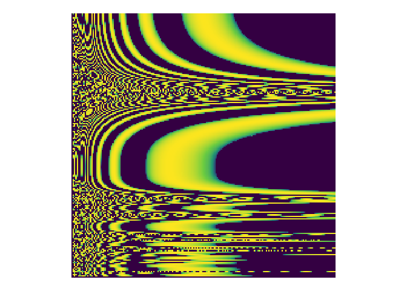

<!-- README.md is generated from README.Rmd. Please edit that file -->

# bnf 

<!-- badges: start -->


<!-- badges: end -->

The goal of `bnf` is to parse grammar specifications in [Backus–Naur
form (BNF)](https://en.wikipedia.org/wiki/Backus%E2%80%93Naur_form) and
generate language from that grammar.

The focus for \#OzUnconf19 was to generate valid R code from a very
restricted subset of the R grammar.

This generated code was then used to calculated coordinates to visualise
and turn into audio.

## Installation

And the development version from [GitHub](https://github.com/) with:

``` r
# install.packages("devtools")
devtools::install_github("coolbutuseless/minilexer")
devtools::install_github("ropenscilabs/bnf")
```

## Turning BNF Grammar into Code

1.  Need a grammar in BNF form
2.  Turn this into an R list that we can compute on
3.  Generate language from this grammar
4.  Ask R to `eval()` this language

<!-- end list -->

``` r
library(bnf)

# BNF grammar for a simple calculator
cat(bnf:::simple_bnf)
```

    #> 
    #> Expr   ::= Term ('+' Term | '-' Term)* ;
    #> Term   ::= Number ('*' Number | '/' Number)* ;
    #> Number ::= ('0' | '1' | '2' | '3' | '4' | '5' | '6' | '7' | '8' | '9')+ ;

``` r
# Turn the BNF into tokens (to make it easier to manipulate)
tokens <- bnf::parse_bnf_text_to_tokens(bnf:::simple_bnf)
tokens
```

    #>       WORD     ASSIGN       WORD   LBRACKET       WORD       WORD         OR 
    #>     "Expr"      "::="     "Term"        "("        "+"     "Term"        "|" 
    #>       WORD       WORD RBRACKET0P  ENDOFRULE       WORD     ASSIGN       WORD 
    #>        "-"     "Term"       ")*"       " ;"     "Term"      "::="   "Number" 
    #>   LBRACKET       WORD       WORD         OR       WORD       WORD RBRACKET0P 
    #>        "("        "*"   "Number"        "|"        "/"   "Number"       ")*" 
    #>  ENDOFRULE       WORD     ASSIGN   LBRACKET       WORD         OR       WORD 
    #>       " ;"   "Number"      "::="        "("        "0"        "|"        "1" 
    #>         OR       WORD         OR       WORD         OR       WORD         OR 
    #>        "|"        "2"        "|"        "3"        "|"        "4"        "|" 
    #>       WORD         OR       WORD         OR       WORD         OR       WORD 
    #>        "5"        "|"        "6"        "|"        "7"        "|"        "8" 
    #>         OR       WORD RBRACKET1P  ENDOFRULE 
    #>        "|"        "9"       ")+"       " ;"

``` r
# Turn the tokens into an internal nexted list representation that we can 
# compute on.  This is a *deeply* nested list.
spec <- bnf::parse_bnf_tokens_to_spec(tokens)
```

    #> Parsing: Expr

    #> Parsing: Term

    #> Parsing: Number

``` r
cat(paste(deparse(spec), collapse="\n"))
```

    #> list(Expr = list(list(items = list("Term"), N = "one", type = "all"), 
    #>     list(items = list(list(items = list("+", "Term"), N = "one", 
    #>         type = "all"), list(items = list("-", "Term"), N = "one", 
    #>         type = "all")), N = "zero_or_more", type = "choice")), 
    #>     Term = list(list(items = list("Number"), N = "one", type = "all"), 
    #>         list(items = list(list(items = list("*", "Number"), N = "one", 
    #>             type = "all"), list(items = list("/", "Number"), 
    #>             N = "one", type = "all")), N = "zero_or_more", type = "choice")), 
    #>     Number = list(NULL, list(items = list(list(items = list("0"), 
    #>         N = "one", type = "all"), list(items = list("1"), N = "one", 
    #>         type = "all"), list(items = list("2"), N = "one", type = "all"), 
    #>         list(items = list("3"), N = "one", type = "all"), list(
    #>             items = list("4"), N = "one", type = "all"), list(
    #>             items = list("5"), N = "one", type = "all"), list(
    #>             items = list("6"), N = "one", type = "all"), list(
    #>             items = list("7"), N = "one", type = "all"), list(
    #>             items = list("8"), N = "one", type = "all"), list(
    #>             items = list("9"), N = "one", type = "all")), N = "one_or_more", 
    #>         type = "choice")))

``` r
# Create a random bit of language from this grammar
set.seed(2)
lang <- bnf_expression(spec, spec)
lang
```

    #> [1] "5-81+25+12*658/752*6/51"

``` r
eval(parse(text = lang))
```

    #> [1] -49.76471

## Generate Art: Using a grammar to create code which will calculate coordinates which can be plotted

1.  More complicated grammar with some trig functions and function
    nesting
2.  Generate some R language
3.  Evaluate the language at a number of grid points
4.  Plot it\!

<!-- end list -->

``` r
# Generate some R language from this grammar
set.seed(16)
lang <- bnf_expression(simple_spec$expr, simple_spec, 1.5, 1.5)
lang
```

    #> [1] "733-758+x/348*x+sin(52/cos(68+cos(80+sin(123)+66/y)+cos(713+x-x))/x)*447"

``` r
# Evaluate this language at multiple points on a grid
fun <- bnf_function(lang)
dat_grid <- bnf::dat_generation_grid(fun, 200, 0.15, 200, 0.15)

# plot it
ggplot(dat_grid, aes(x, y)) +
  geom_tile(aes(fill = abs(log(z)))) +
  theme_void() + 
  theme(legend.position = 'none') +
  scale_fill_viridis_c(na.value = '#440154FF') +
  coord_equal()
```


