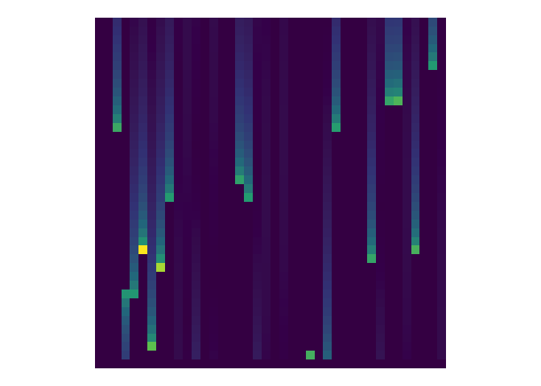
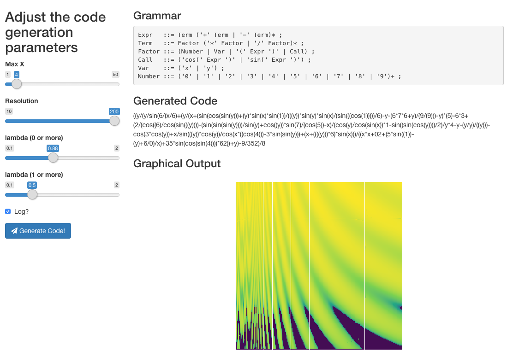

<!-- README.md is generated from README.Rmd. Please edit that file -->

# bnf 

<!-- badges: start -->


<!-- badges: end -->

The goal of `bnf` is to parse grammar specifications in [Backus–Naur
form (BNF)](https://en.wikipedia.org/wiki/Backus%E2%80%93Naur_form) and
generate code from that grammar.

### Focus for \#OzUnconf19 (December 2019)

1.  Parse BNF (in text form) into R
2.  Sketch out a representation for BNF grammar in R
3.  Generate code from some simple grammars
4.  Evaluate, plot, visualise or create audio using the generated code

### Future Work

  - The current BNF parsing process is very rough It needs a
    refactor/rewrite to improve:
      - Robustness
      - Correctness
      - Completeness
      - Readability
  - Need to document the particular idiosyncratic flavour of BNF that is
    supported e.g. must have a trailing `;` after each rule
  - Work on a more complete R grammar in order to generate more
    interesting programs.
  - More tunable code generation parameters
      - e.g. generation of “zero or more” elements samples from a
        poisson distribution, but the lambda for this distribution is
        set globally. It would be nice to be separately configurable for
        each rule.

## Installation

Install the development version from [GitHub](https://github.com/). This
will also require installing
[minilexer](https://github.com/coolbutuseless/minilexer) which is used
in parsing the original BNF grammar

``` r
# install.packages("devtools")
devtools::install_github("coolbutuseless/minilexer")
devtools::install_github("ropenscilabs/bnf")
```

## Simple Example: Read a BNF grammar into R and use it to generate code

1.  Start with a grammar in BNF form
2.  Turn this into an R list that we can compute on
3.  Generate code from this grammar
4.  Ask R to `eval()` this code

#### Simple 1. Start with a grammar in BNF Form

``` r
library(bnf)
cat(bnf:::simple_bnf)
#> 
#> Expr   ::= Term ('+' Term | '-' Term)* ;
#> Term   ::= Number ('*' Number | '/' Number)* ;
#> Number ::= ('0' | '1' | '2' | '3' | '4' | '5' | '6' | '7' | '8' | '9')+ ;
```

#### Simple 2. Turn this into an R list that we can compute on

``` r
bnf_spec <- bnf::parse_bnf(bnf:::simple_bnf)
bnf_spec
```

<details>

<summary>Click here to show/hide the BNF spec as an R object (a deeply
nested list)</summary>

``` r
list(
  Expr = list(
    list(items = list("Term")), 
    list(
      items = list(
        list(items = list("+", "Term")), 
        list(items = list("-", "Term"))
      ),
      N = "zero_or_more", type = "choice")
  ), 
  Term = list(
    list(items = list("Number")), 
    list(
      items = list(
        list(items = list("*", "Number")),
        list(items = list("/", "Number"))
      ), 
      N = "zero_or_more", type = "choice")
  ),
  Number = list(
    items = list(
      list(items = list("0")), 
      list(items = list("1")), 
      list(items = list("2")), 
      list(items = list("3")), 
      list(items = list("4")), 
      list(items = list("5")),
      list(items = list("6")), 
      list(items = list("7")), 
      list(items = list("8")), 
      list(items = list("9"))
    ), 
    N = "one_or_more", type = "choice")
)
```

</details>

#### Simple 3. Generate code from this grammar

``` r
set.seed(2)
(code <- bnf::generate_code(bnf_spec = bnf_spec))
#> [1] "5-81+25+12*6"
```

#### Simple 4. Ask R to `eval()` this code

``` r
eval(parse(text = code))
#> [1] 21
```

## Generative Art: Create “art” from the output of generated code

#### Art 1. Start with a more complicated grammar (with trigonometry and variables)

``` r
simple_bnf_with_trig <- "
Expr   ::= Term ('+' Term | '-' Term)* ;
Term   ::= Factor ('*' Factor | '/' Factor)* ;
Factor ::= (Number | Var |  '(' Expr ')' | Call) ;
Call   ::= ('cos(' Expr ')' | 'sin(' Expr ')') ;
Var    ::= ('x' | 'y') ;
Number ::= ('0' | '1' | '2' | '3' | '4' | '5' | '6' | '7' | '8' | '9')+ ;
"

bnf_spec <- bnf::parse_bnf(simple_bnf_with_trig)
```

<details>

<summary> Click to see R representation of this grammar </summary>

``` r
list(
  Expr = list(
    list(items = list("Term")),
    list(
      items = list(
        list(items = list("+", "Term")), 
        list(items = list("-", "Term"))
      ),
      N    = "zero_or_more",
      type = "choice"
    )
  ),
  
  Term = list(
    list(items = list("Factor")),
    list(
      items = list(
        list(items = list("*", "Factor")), 
        list(items = list("/", "Factor"))
      ),
      N    = "zero_or_more",
      type = "choice"
    )
  ),
  
  Factor = list(
    items = list(
      list(items = list("Number")),
      list(items = list("Var")),
      list(items = list("(", "Expr", ")")),
      list(items = list("Call"))
    ), 
    type = "choice"
  ),
  
  
  Call = list(
    items = list(
      list(items = list("cos(", "Expr", ")")), 
      list(items = list("sin(", "Expr", ")"))
    ), 
    type = "choice"
  ),
  
  
  Var = list(
    items = list(
      list(items = list("x")), 
      list(items = list("y"))
    ), 
    type = "choice"
  ),
  
  
  Number = list(
    items = list(
      list(items = list("0")),
      list(items = list("1")),
      list(items = list("2")),
      list(items = list("3")),
      list(items = list("4")),
      list(items = list("5")),
      list(items = list("6")),
      list(items = list("7")),
      list(items = list("8")),
      list(items = list("9"))
    ),
    N    = "one_or_more",
    type = "choice"
  )
)
```

</details>

#### Art 2: Generate some code from this grammar

``` r
#~~~~~~~~~~~~~~~~~~~~~~~~~~~~~~~~~~~~~~~~~~~~~~~~~~~~~~~~~~~~~~~~~~~~~~~~~~~~~
# Generate some R code from this grammar
#~~~~~~~~~~~~~~~~~~~~~~~~~~~~~~~~~~~~~~~~~~~~~~~~~~~~~~~~~~~~~~~~~~~~~~~~~~~~~
set.seed(18) # 8
code <- bnf::generate_code(bnf_spec = bnf_spec, lambda0p = 0.5, lambda1p = 0.5)
code
#> [1] "y/y/3-cos(y-45*cos((07)*sin(4/x+x))+0/y)"
```

#### Art 3: Evaluate code at single (x, y) location

``` r
#~~~~~~~~~~~~~~~~~~~~~~~~~~~~~~~~~~~~~~~~~~~~~~~~~~~~~~~~~~~~~~~~~~~~~~~~~~~~~
# Evaluate this code in R at a single (x, y) location
#~~~~~~~~~~~~~~~~~~~~~~~~~~~~~~~~~~~~~~~~~~~~~~~~~~~~~~~~~~~~~~~~~~~~~~~~~~~~~
eval(parse(text = code), list(x = 1, y = 2))
#> [1] -0.01241846
```

#### Art 4: Evaluate code on a grid and plot

``` r
#~~~~~~~~~~~~~~~~~~~~~~~~~~~~~~~~~~~~~~~~~~~~~~~~~~~~~~~~~~~~~~~~~~~~~~~~~~~~~
# Evaluate this code at multiple points on a grid
#~~~~~~~~~~~~~~~~~~~~~~~~~~~~~~~~~~~~~~~~~~~~~~~~~~~~~~~~~~~~~~~~~~~~~~~~~~~~~
plot_df <- bnf::eval_grid(code, xmin = 0, xmax = 1, xn = 40)

#~~~~~~~~~~~~~~~~~~~~~~~~~~~~~~~~~~~~~~~~~~~~~~~~~~~~~~~~~~~~~~~~~~~~~~~~~~~~~
# plot it
#~~~~~~~~~~~~~~~~~~~~~~~~~~~~~~~~~~~~~~~~~~~~~~~~~~~~~~~~~~~~~~~~~~~~~~~~~~~~~
ggplot(plot_df, aes(x, y)) +
  geom_tile(aes(fill = abs(log(z)))) +
  theme_void() + 
  theme(legend.position = 'none') +
  scale_fill_viridis_c(na.value = '#440154FF') +
  coord_equal()
```



## Shiny app

The package includes a shiny app to explore graphical representations of
the generated code.

``` r
bnf::run_example()
```


